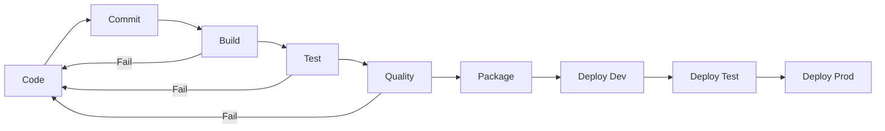

# Phase 6 Part 1: CI/CD Strategy and Infrastructure

## Overview

This document outlines the first part of Phase 6, which focuses on establishing a comprehensive CI/CD strategy and the necessary infrastructure to support it. This strategy will guide the implementation of continuous integration and deployment processes for the Total Battle Analyzer application, ensuring consistent, reliable, and automated delivery of new features and fixes.

## Implementation Tasks

### 1. CI/CD Strategy Development

- [ ] Define CI/CD workflow and pipeline stages
- [ ] Establish quality gates and approval processes
- [ ] Create deployment strategy for different environments
- [ ] Define rollback and recovery procedures
- [ ] Document CI/CD processes and responsibilities

### 2. Infrastructure Setup

- [ ] Set up CI/CD server (GitHub Actions, GitLab CI, Jenkins, etc.)
- [ ] Configure build agents/runners
- [ ] Set up artifact repository
- [ ] Configure environment management tools
- [ ] Implement secrets and credentials management

### 3. Version Control Strategy

- [ ] Define branching strategy (e.g., Gitflow, GitHub Flow)
- [ ] Set up branch protection rules
- [ ] Configure automated code review processes
- [ ] Define merge request/pull request workflow
- [ ] Set up automated versioning

### 4. Environment Configuration

- [ ] Define development environment setup
- [ ] Configure testing environment
- [ ] Set up staging environment
- [ ] Define production environment requirements
- [ ] Implement environment isolation measures

## Detailed Implementation

### 1. CI/CD Strategy Development

#### 1.1 CI/CD Workflow Definition

The Total Battle Analyzer application will follow a modern CI/CD workflow with the following stages:

1. **Code** - Developers work in feature branches
2. **Commit** - Changes are pushed to version control
3. **Build** - Automated build is triggered
4. **Test** - Automated tests are executed
5. **Quality** - Code quality checks are performed
6. **Package** - Application is packaged as installable
7. **Deploy (Dev)** - Automatic deployment to development
8. **Deploy (Test)** - Automatic deployment to test with approval
9. **Deploy (Prod)** - Deployment to production with approval



#### 1.2 Quality Gates

To ensure application quality, the following quality gates will be implemented:

| Stage | Quality Gate | Description |
|-------|-------------|-------------|
| Build | Successful compilation | Code must build successfully without errors |
| Test | Unit tests passing | All unit tests must pass |
| Test | Integration tests passing | All integration tests must pass |
| Test | UI tests passing | All UI tests must pass |
| Quality | No critical code quality issues | Code must meet quality standards |
| Quality | Test coverage > 80% | Code must have adequate test coverage |
| Quality | Security scan passed | No critical security vulnerabilities |
| Deploy (Test) | Manual approval | Team lead must approve test deployment |
| Deploy (Prod) | Manual approval | Product owner must approve production deployment |

#### 1.3 Deployment Strategy

The deployment strategy will follow these principles:

1. **Environment Progression**: Changes flow from development to testing to production
2. **Automation**: All deployments are automated through CI/CD pipelines
3. **Consistency**: Same deployment process used for all environments
4. **Immutability**: Environments are not modified in place; new versions are deployed
5. **Observability**: All deployments are logged and monitored

#### 1.4 Rollback and Recovery

In case of deployment failures, the application will support:

1. **Automated Rollback**: Failed deployments automatically trigger rollback to previous working version
2. **Manual Rollback**: Option for manual rollback to any previous version
3. **Deployment Window**: Production deployments happen during defined maintenance windows
4. **Canary Deployments**: Optional gradual rollout for high-risk changes

### 2. Infrastructure Setup

#### 2.1 CI/CD Server

GitHub Actions will be used as the CI/CD server due to:
- Integration with the existing GitHub repository
- Serverless architecture eliminates maintenance overhead
- Strong ecosystem of pre-built actions
- Matrix build support for cross-platform testing

#### 2.2 Workflow Configuration

**Main CI Workflow** (.github/workflows/ci.yml):

```yaml
name: Total Battle Analyzer CI

on:
  push:
    branches: [ main, develop ]
  pull_request:
    branches: [ main, develop ]

jobs:
  build:
    runs-on: ${{ matrix.os }}
    strategy:
      matrix:
        os: [ubuntu-latest, windows-latest, macos-latest]
        python-version: [3.8, 3.9, 3.10]

    steps:
    - uses: actions/checkout@v3
    - name: Set up Python ${{ matrix.python-version }}
      uses: actions/setup-python@v4
      with:
        python-version: ${{ matrix.python-version }}
    
    - name: Install dependencies
      run: |
        python -m pip install --upgrade pip
        python -m pip install uv
        uv pip install -e .[dev]
    
    - name: Lint with ruff
      run: |
        uv pip install ruff
        ruff check .
    
    - name: Test with pytest
      run: |
        pytest tests/ --cov=src --cov-report=xml
    
    - name: Upload coverage to Codecov
      uses: codecov/codecov-action@v3
      with:
        file: ./coverage.xml
        fail_ci_if_error: true
```

**CD Workflow** (.github/workflows/cd.yml) for deployment:

```yaml
name: Total Battle Analyzer CD

on:
  push:
    tags:
      - 'v*'

jobs:
  build-packages:
    runs-on: ${{ matrix.os }}
    strategy:
      matrix:
        os: [ubuntu-latest, windows-latest, macos-latest]
    
    steps:
    - uses: actions/checkout@v3
    - name: Set up Python
      uses: actions/setup-python@v4
      with:
        python-version: '3.10'
    
    - name: Install dependencies
      run: |
        python -m pip install --upgrade pip
        python -m pip install build wheel
    
    - name: Build package
      run: |
        python -m build
    
    - name: Create installer
      run: |
        # OS-specific installer creation
        if [ "${{ matrix.os }}" == "windows-latest" ]; then
          # Windows installer
          pip install pyinstaller
          pyinstaller --onefile --windowed src/app.py
        elif [ "${{ matrix.os }}" == "macos-latest" ]; then
          # macOS app bundle
          pip install py2app
          python setup.py py2app
        else
          # Linux AppImage
          pip install pynsis
          python setup.py bdist_pynsis
        fi
    
    - name: Upload artifacts
      uses: actions/upload-artifact@v3
      with:
        name: ${{ matrix.os }}-package
        path: |
          dist/
          build/
```

#### 2.3 Artifact Repository

For artifact storage:
- Use GitHub Packages for Python package distribution
- GitHub Releases for binary installers
- Configure GitHub API token for automated uploads

#### 2.4 Secrets and Credentials Management

The following secrets will be managed through GitHub Actions secrets:
- `PYPI_API_TOKEN`: For publishing to PyPI
- `CODECOV_TOKEN`: For uploading coverage reports
- `SIGNING_CERTIFICATE`: For code signing (Windows/macOS)
- `DEPLOY_KEY`: SSH key for deployment to servers

### 3. Version Control Strategy

#### 3.1 Branching Strategy

The Total Battle Analyzer will use a simplified Gitflow strategy:

```
main           ●───────●─────────────●──────● (stable releases)
               │       │             │      │
               │       │             │      │
develop        ●───●───●───●─────●───●──────● (integration branch)
                \     /   /     \     \     \
feature-1        ●───●   │       \     \     \
                         │        \     \     \
feature-2                ●─────────●     \     \
                                          \     \
feature-3                                  ●─────●
```

- **main**: Stable production code only
- **develop**: Integration branch for features
- **feature/\***: Individual feature branches
- **release/\***: Release candidate branches
- **hotfix/\***: Emergency fixes for production

#### 3.2 Branch Protection Rules

For `main` branch:
- Require pull request approvals (2 reviewers)
- Require status checks to pass
- Require linear history
- Do not allow force pushes
- Do not allow deletion

For `develop` branch:
- Require pull request approvals (1 reviewer)
- Require status checks to pass
- Allow force pushes by administrators

#### 3.3 Automated Versioning

Semantic versioning (MAJOR.MINOR.PATCH) will be used:
- MAJOR: Breaking changes
- MINOR: New features, backwards-compatible
- PATCH: Bug fixes, backwards-compatible

Version bumping will be automated using:

```bash
# In .github/workflows/release.yml
- name: Bump version
  id: bump_version
  uses: phips28/gh-action-bump-version@master
  with:
    tag-prefix: 'v'
    minor-wording: 'feat,feature'
    major-wording: 'BREAKING,MAJOR'
    patch-wording: 'fix,bugfix,patch'
  env:
    GITHUB_TOKEN: ${{ secrets.GITHUB_TOKEN }}
```

### 4. Environment Configuration

#### 4.1 Environment Definitions

| Environment | Purpose | Access | Deployment Frequency |
|-------------|---------|--------|----------------------|
| Development | For developers during active development | Developers only | Continuous (every commit) |
| Testing | For QA and feature validation | Team members | On feature completion |
| Staging | Pre-production validation | Stakeholders | Before planned releases |
| Production | End-user environment | Public users | Scheduled releases |

#### 4.2 Environment Configuration Management

Environment-specific configuration will be managed through:

1. Configuration files per environment
2. Environment variables for sensitive information
3. Feature flags for controlled rollout

Configuration example in `config.py`:

```python
import os
from pathlib import Path
from enum import Enum

class Environment(Enum):
    DEVELOPMENT = "development"
    TESTING = "testing"
    STAGING = "staging"
    PRODUCTION = "production"

# Determine current environment
ENVIRONMENT = Environment(os.getenv("APP_ENVIRONMENT", "development"))

# Base configuration
BASE_CONFIG = {
    "log_level": "INFO",
    "data_dir": Path("data"),
    "export_dir": Path("exports"),
    "max_file_size_mb": 100,
    "enable_analytics": False,
}

# Environment-specific overrides
ENV_CONFIGS = {
    Environment.DEVELOPMENT: {
        "log_level": "DEBUG",
        "enable_debug_tools": True,
    },
    Environment.TESTING: {
        "log_level": "DEBUG",
        "test_data_dir": Path("test_data"),
    },
    Environment.STAGING: {
        "enable_analytics": True,
    },
    Environment.PRODUCTION: {
        "log_level": "WARNING",
        "enable_analytics": True,
        "max_file_size_mb": 500,
    }
}

# Merge configurations
CONFIG = {**BASE_CONFIG, **ENV_CONFIGS.get(ENVIRONMENT, {})}
```

## Implementation Approach

The implementation of Phase 6 Part 1 will follow a methodical approach:

1. **Planning and Documentation** (Days 1-2)
   - Finalize CI/CD strategy documents
   - Create detailed workflow diagrams
   - Document branching strategy

2. **Infrastructure Setup** (Days 3-5)
   - Set up GitHub Actions workflows
   - Configure branch protection rules
   - Set up secrets and credentials

3. **Environment Configuration** (Days 6-7)
   - Create environment configuration management
   - Set up development environment
   - Configure testing environment

4. **Validation and Testing** (Days 8-10)
   - Validate CI/CD workflows with test commits
   - Test branch protection rules
   - Verify environment configurations

## Dependencies

This part has dependencies on:
- Completed Phase 5: Testing and Quality Assurance
- Access to GitHub repository settings
- Understanding of application deployment requirements

## Expected Outcomes

After completing Phase 6 Part 1, the project will have:
1. A documented CI/CD strategy
2. Configured CI/CD infrastructure with GitHub Actions
3. An established branching strategy with protection rules
4. Environment configuration management
5. The foundation for implementing the remaining parts of Phase 6 